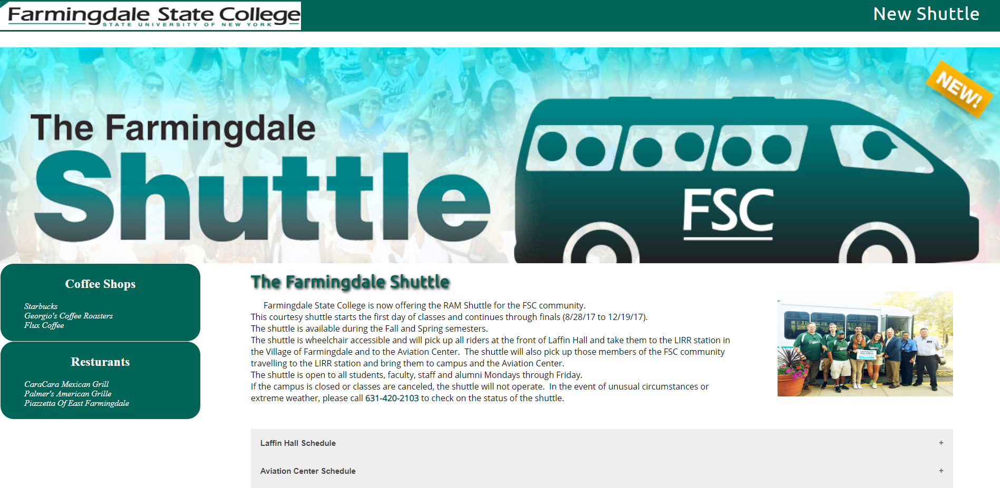

# Farmingdale State College

## Project Description

A webpage that displays an improved version and layout of the Farmingdale State College shuttle bus schedule with transfer to MTA & LIRR transit for students to utilize in a day to day life.

### Getting Started

These instructions will get you a copy of the project up and running on your local machine for development and testing purposes.
- git clone “https://github.com/sshahrier/farmingdale-shuttlebus.git”
- Run the `shuttle.html` file to begin to the start of opening your webpage

### Prerequisites

There are no additional installation of packages or libraries required for this project all you require is a web browser such as Mozilla Firefox or Google Chrome to run the page.

## Contributor
- [Sayem Shahrier](https://github.com/sshahrier)

## License & Copyright

Licensed under the [MIT License](LICENSE).
 
Copyright ©️ 2018. Sayem Shahrier.
 
All Rights Reserved.
# farmingdale-shuttlebus
